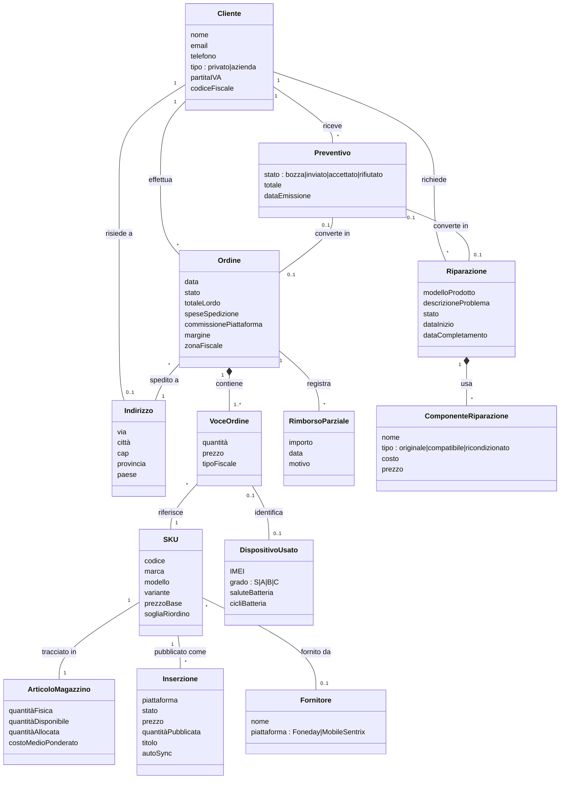

# Guida allo studio APS — Francesco

> File-riassunto di tutto il materiale prodotto durante le sessioni di preparazione.
> Caso di studio usato per gli esempi: il gestionale **FF PHONE LAB** (`C:\Personale\FF PHONE LAB\Gestionale\studio-main`, Next.js + TypeScript).
> Libro di riferimento del corso: Craig Larman, *Applying UML and Patterns* (slide prof. Riganelli).
>
> **Indice**
> 1. Metodo di studio per superare l'ORALE (la parte più importante)
> 2. Mappatura slide APS → gestionale
> 3. Piano di preparazione (3+ settimane)
> 4. Lezione 1 — Modello di Dominio (con diagramma del gestionale)
> 5. Materiale collegato (flashcard GRASP + GoF)

---

## 1. Metodo di studio per superare l'ORALE

### Diagnosi: perché si viene bocciati all'orale (non allo scritto)
Scritto e orale testano **due abilità diverse**:
- **Scritto = applicare**: ti danno un problema, produci diagrammi/codice. È **riconoscimento** (vedi il contesto e reagisci).
- **Orale = spiegare e difendere**: ti danno una parola ("Controller", "Adapter") e devi tirare fuori tutto dal nulla. È **richiamo attivo (recall) + verbalizzazione**.

"Lo sapevo ma non sapevo spiegarlo" = conoscenza **passiva/riconoscibile** ma non **attiva/verbalizzabile**. Rileggere le slide allena il riconoscimento, NON il richiamo → per questo ci si blocca all'orale. La buona notizia: il richiamo attivo **si allena**.

### Lo "scheletro a 5 caselle" (anti-blocco)
Quando il prof chiede un pattern, NON cercare frasi a memoria: ricorda una **struttura fissa** e riempila. Tutti i pattern (GRASP e GoF) si rispondono con lo stesso scheletro:

1. **PROBLEMA** → la domanda a cui il pattern risponde
2. **SOLUZIONE** → il principio in una frase
3. **DISEGNO** → schizzo UML minimo (2-3 classi)
4. **ESEMPIO** → uno concreto (il tuo gestionale)
5. **TRADE-OFF / CORRELATI** → pro, contro, quando NON usarlo

Frase-jolly: *"Questo pattern serve a [problema]. La soluzione è [principio]. Per esempio, nel mio gestionale [esempio]. Il trade-off è [pro/contro]."*
Se interiorizzi lo scheletro non ti blocchi: anche senza ricordare i dettagli, parti dalla casella 1 e il resto viene. I prof premiano chi risponde con **struttura** (dimostra il *perché*, non il pappagallo).

### Le 5 tecniche
1. **Active recall, non rilettura**: dopo ogni argomento chiudi tutto e spiega a voce come se ci fosse il prof. Dove ti blocchi = il buco; torna alla slide SOLO per quel buco.
2. **Tecnica di Feynman**: spiega ogni pattern a voce come a un compagno che non sa nulla. Se usi le parole della slide senza saperle ridire tue, non l'hai capito.
3. **Flashcard a ripetizione spaziata** per la parte "a memoria" (9 GRASP + 7 GoF): fronte = nome, retro = 5 caselle. Ripasso: oggi, +1g, +3g, +7g, +14g.
4. **Simulazioni orali a freddo**: qualcuno (o l'AI) fa il prof, spara una parola, tu rispondi a voce; correzione da esaminatore (non solo giusto/sbagliato, ma "qui hai esitato", "mancava il trade-off", "questa è progettazione, non analisi").
5. **Il gestionale come arma**: ancora ogni pattern a un esempio del tuo codice (lo conosci a memoria perché l'hai scritto tu). Portare un esempio **tuo** invece del solito NextGen POS dimostra comprensione reale.

---

## 2. Mappatura slide APS → gestionale

| Slide APS | Concetto | Dove vederlo nel gestionale |
|---|---|---|
| 02 Processi Software | UP iterativo/incrementale | il flusso di lavoro stesso (refactor incrementali, orchestrator riscritto più volte) |
| 03 Studi di caso | NextGen POS / Monopoli | il gestionale **È** un POS + inventory esteso |
| 04 Requisiti | Funzionali / non funzionali | "non voglio che qty vada a 0 senza autosync", "percentuale rimborso" |
| 05 Casi d'uso | UC + scenari | `Sincronizza inserzione`, `Crea listing`, `Rimborsa ordine parziale`, `Importa fattura Foneday` |
| 06 Modello di dominio | Concetti, associazioni, attributi | `Product`, `Listing`, `Order`, `Refund`, `Supplier`, `Lotto`, `SKU` |
| 07 SSD + Contratti | Operazioni di sistema + pre/post | `autoSyncListing(sku, qty)` → post: `Listing.qty` aggiornata su tutti i canali |
| 08 Architettura logica | Layer | `src/app` (UI) / `actions.ts` (application) / `src/lib` (domain+infra) |
| 09 Refactoring | Code smells, Extract Method/Class | estratti `sync-orchestrator.ts`, `product-classifier.ts`, `use-pricing-engine.ts` |
| 10 Diagrammi interazione | Sequence/Communication | `bulk-auto-sync-dialog` → action → orchestrator → API supplier |
| 11 Diagrammi classi | Classi di progetto, visibilità | TypeScript types in `actions.types.ts` |
| 12 Macchine a stati | Stati + transizioni | stati `Order` (creato→pagato→spedito→consegnato→rimborsato) o `Repair` (kanban) |
| 13 Attività | Workflow | sync orchestrator, autofattura, used-evaluator |
| 14-16 GRASP | I 9 pattern | `sync-orchestrator` = Controller+Pure Fabrication; classifier; adapter |
| 17 GoF | Adapter, Strategy, Observer, Facade, Singleton… | adapter Foneday/MobileSentrix; pricing engine; auto-sync queue; `actions.ts` |

**Layer Larman → cartelle gestionale**
- Presentation → `src/app/**/page.tsx` + componenti React
- Application → `src/app/**/actions.ts` (server actions = Controller GRASP)
- Domain → `src/lib/` (classifier, pricing, logica di business)
- Persistence/Infrastructure → `src/lib/db/`, integrazioni Foneday/MobileSentrix/eBay/Shopify

---

## 3. Piano di preparazione (3+ settimane)

**Settimana 1 — Fondamenta + requisiti**
- 02 Processi (UP, agile vs waterfall) · 04 Requisiti (FURPS+, funz./non funz.) · 05 Casi d'uso (formato esteso, scenari, attori) · 06 Modello di dominio
- Output: lista UC + modello di dominio del gestionale

**Settimana 2 — Dal "cosa" al "come"**
- 07 SSD + contratti · 08 Architettura a layer · 10-11 Interazione + classi · 12-13 Stati + attività
- Output: SSD + contratti dei UC chiave, class diagram di un modulo

**Settimana 3 — Pattern (cuore dell'esame)**
- 14-16 GRASP (tutti e 9) · 17 GoF · 09 Refactoring
- Output: identificare TUTTI i pattern già presenti nel gestionale

**Settimana 4 — Simulazioni**
- Domande orale (Sofia, Vale, Blue3141) · temi scritto (foto in `/Esame`) · ripasso punti deboli

---

## 4. Lezione 1 — Modello di Dominio (slide 06)

### Teoria in 5 punti (Larman cap. 9)

> **🧒 In parole semplici:** il modello di dominio è come la **mappa dei personaggi** di una storia disegnata *prima* di scriverla: chi c'è (Cliente, Ordine, Prodotto), cosa sa ognuno (nome, prezzo, data) e come sono **legati** tra loro (un Cliente *fa* un Ordine). Non dici ancora *cosa fanno nel dettaglio* (niente metodi): disegni solo **chi esiste e come si conosce**.

1. **Cos'è**: rappresentazione visiva (class diagram **senza metodi**) dei **concetti del mondo reale** rilevanti. È un vocabolario condiviso, NON un diagramma software.
2. **Cosa contiene**: classi concettuali (sostantivi: Cliente, Ordine, Prodotto), attributi (proprietà semplici), associazioni con molteplicità (`1`, `0..1`, `*`, `1..*`) e nome del ruolo.
3. **Cosa NON contiene** (errori da bocciatura):
   - Metodi/operazioni → vanno nel diagramma di classi di progetto
   - Tipi di dato puri (String, int) → non sono concetti di dominio
   - Classi software/tecniche (Controller, DBConnection, Repository) → è progettazione
   - Attributi che in realtà sono classi (es. `Indirizzo` con via+cap+città → è una **classe**)
4. **Come si costruisce**: lista dei sostantivi dai casi d'uso/glossario → filtra il rilevante → associazioni leggendo "un X **ha** uno Y" → attributi (cose semplici da "ricordare").
5. **A cosa serve**: input per i **contratti delle operazioni** (07) e per il **diagramma di classi di progetto** (11). Riduce il gap tra esperti di dominio e sviluppatori.

### Modello di dominio del gestionale (estratto dai tipi reali in `src/lib/types.ts`)
NB: tolto tutto ciò che è tecnico (`syncError`, `platformListingId`, `ebayOfferId`…) perché sono dettagli di **progettazione**, non concetti di dominio.



**Note di lettura**
- **Composizione `*--`**: `Ordine` compone `VoceOrdine` (le voci non vivono senza l'ordine). Stesso per `Riparazione → ComponenteRiparazione`.
- **Associazione `--`**: `Cliente — Ordine` (esistono indipendentemente).
- **`Indirizzo` promosso a classe** anche se nel codice è un campo di `Customer`: ha struttura propria (via+cap+città…) ed è riusato (spedizione ordine + residenza cliente). Larman raccomanda la promozione quando un "attributo" ha struttura.

### Domande tipo orale su questo diagramma (con risposta)
- **D: "Non vedo `SyncOrchestrator` né `PricingEngine` nel modello di dominio, eppure sono centrali. Come mai?"**
  R: Perché il modello di dominio rappresenta solo **concetti del mondo reale** (analisi), non classi software (progettazione). `SyncOrchestrator`/`PricingEngine` sono **Pure Fabrication**: nascono dopo, nei diagrammi di interazione/classi di progetto.
- **D: "Difendi `Cliente 1 -- * Ordine`: perché non `0..1` lato cliente?"**
  R: Sto assumendo che ogni ordine sia **sempre** associato a esattamente un cliente (anche gli ordini marketplace hanno un acquirente). Se ammettessi ordini "anonimi" senza cliente, lato cliente sarebbe `0..1`. È una scelta che dipende dalle regole di dominio.

---

## 5. Materiale collegato

- **`Flashcard_GRASP_GoF.md`** (stessa cartella) — il mazzo completo:
  - 9 flashcard **GRASP** (Information Expert, Creator, Low Coupling, High Cohesion, Controller, Polymorphism, Pure Fabrication, Indirection, Protected Variations)
  - 7 flashcard **GoF** spiegati dal prof (Adapter, Factory, Singleton, Strategy, Composite, Facade, Observer) + tabella di classificazione dei 23
  - Sezione "domande trabocchetto" con risposte pronte
  - Ogni card usa lo scheletro a 5 caselle ed è ancorata a un esempio reale del gestionale

---

## 6. Domande orale GIÀ RICEVUTE (risposte-modello)

> Queste sono domande che il prof ha **davvero** fatto a Francesco agli appelli precedenti. Da sapere a memoria.

---

### DOMANDA A (1° appello) — "Quali cose di UP abbiamo applicato/creato noi nel corso?"

> **🧒 In parole semplici:** UP è la **ricetta** per costruire un programma **un pezzetto alla volta** (a piccole "iterazioni"), assaggiando e correggendo man mano, invece di cucinare tutto in un colpo solo sperando che vada bene. Le "cose di UP" che abbiamo creato sono i **fogli di lavoro** prodotti lungo la ricetta (modello di dominio, casi d'uso, diagrammi…).

**Come impostare la risposta (struttura):** prima dico cos'è UP in una frase, poi dico su quali **discipline** si concentra il corso, poi elenco gli **elaborati** che abbiamo prodotto disciplina per disciplina, infine cito le **pratiche**.

**1. Cos'è UP** — Il **Processo Unificato** è un processo **iterativo, incrementale ed evolutivo** per lo sviluppo OO. Le sue 3 caratteristiche chiave: è **pilotato dai casi d'uso** (e dai rischi), è **incentrato sull'architettura**, ed è **iterativo**. Organizza il lavoro in **4 fasi** (Ideazione → Elaborazione → Costruzione → Transizione) e in **discipline/flussi di lavoro** (Modellazione del business, Requisiti, Progettazione, Implementazione, Test, …).

**2. Su cosa si concentra il corso** — Solo **3 discipline** (le altre sono accennate): **Modellazione del business**, **Requisiti**, **Progettazione**. *(Lo dice la slide "Iterazioni e discipline → Interesse di questo corso".)*

**3. Gli ELABORATI che abbiamo creato** (è il cuore della risposta — viene dallo "Scenario di sviluppo" e dalla figura "Relazione tra gli elaborati di UP"):

| Disciplina | Elaborato prodotto nel corso |
|---|---|
| Modellazione del business | **Modello di Dominio** |
| Requisiti | **Modello dei Casi d'Uso** (diagramma UC + testo UC), **Visione**, **Specifica Supplementare**, **Glossario** + (parte del modello UC) **Diagrammi di Sequenza di Sistema (SSD)** e **Contratti delle operazioni** |
| Progettazione | **Modello di Progetto** = diagrammi di **interazione** (sequenza/comunicazione) + diagrammi delle **classi**; applicando **GRASP** e **GoF** + **Documento dell'Architettura SW** e **Modello dei Dati** (secondari) |

**4. Le PRATICHE** che abbiamo applicato: sviluppo **iterativo guidato dal rischio**, **modellazione agile** con UML (disegno leggero per comprendere/comunicare), **progettazione guidata dalle responsabilità (RDD)**, applicazione di **GRASP** e **design pattern GoF**, **refactoring**.

**Frase di chiusura forte:** *"Quindi il flusso che abbiamo seguito è: dai casi d'uso ricavo il modello di dominio e gli SSD; dagli SSD ricavo le operazioni di sistema e i loro contratti; da lì passo al modello di progetto (interazione + classi) applicando GRASP e GoF. È la catena 'Relazione tra gli elaborati di UP'."*

**Trappola da evitare:** NON dire "ideazione = requisiti, elaborazione = progettazione, costruzione = implementazione". È un errore esplicito nelle slide ("Non si è capito UP se…"): ogni iterazione fa **tutte** le discipline, cambia solo l'enfasi.

**Aggancio gestionale (se vuole un esempio tuo):** *"Il mio gestionale lo sviluppo proprio in modo iterativo ed evolutivo: il sync-orchestrator l'ho riscritto più volte basandomi sul feedback d'uso reale. Non produco tutti gli elaborati UP formali, ma ho di fatto un modello di dominio (i type TypeScript), requisiti che evolvono ('non portare la qty a 0'), e un modello di progetto con pattern (Adapter, Controller…)."*

---

### DOMANDA B (2° appello) — "Come sono collegati i diagrammi di sequenza (e quali sono) con gli strati?"

> **🧒 In parole semplici:** immagina il programma come un **palazzo a piani**: in cima quello che vedi e tocchi (i bottoni = UI), al piano sotto chi *pensa* (il dominio), in cantina i servizi (database). Un **diagramma di sequenza** è la "telecamera" che mostra **come i messaggi salgono e scendono tra i piani** quando premi un bottone. Il primo "diagramma di sistema" (SSD) guarda il palazzo **da fuori, come una scatola nera**; quello di progettazione lo guarda **da dentro, piano per piano**.

**Come impostare la risposta (struttura):** (1) dico QUALI diagrammi di sequenza esistono e la differenza, (2) dico quali sono gli STRATI, (3) spiego il LEGAME, (4) cito chi riceve il messaggio nel dominio (Controller) e il principio Modello-Vista.

**1. Quali diagrammi di sequenza ci sono (DUE tipi):**
- **SSD — Diagramma di Sequenza di Sistema** (analisi/requisiti): il sistema è una **scatola nera**, cioè **un solo oggetto** `:System`. Mostra, per uno scenario di un caso d'uso, gli **eventi di sistema** generati dall'attore e le **operazioni di sistema** corrispondenti (es. `makeNewSale`, `enterItem`). Descrive il *cosa* fa il sistema, non il *come*.
- **Diagramma di sequenza di progettazione / di interazione** (progettazione): è una **scatola bianca**, mostra gli **oggetti interni** che collaborano per realizzare l'operazione. È un **modello dinamico** (insieme al diagramma di comunicazione) e si costruisce applicando **RDD + GRASP**.

**2. Gli strati** (architettura logica a strati): **UI / Presentazione** → **Dominio / Logica applicativa** → **Servizi Tecnici** (es. Persistence). Regola: gli strati alti usano i servizi di quelli bassi, non viceversa.

**3. IL LEGAME (il cuore della risposta — slide "Legame tra SSD, operazioni di sistema e strati"):**
> Le **operazioni di sistema mostrate nell'SSD sono esattamente i messaggi che lo strato UI invia allo strato del Dominio.**

Cioè: la scatola nera `:System` dell'SSD, quando passo alla progettazione, **si "apre" e si distribuisce sugli strati**. Il messaggio che nell'SSD andava `attore → :System`, nel diagramma di progettazione diventa `attore → strato UI → strato Dominio`.

```
   SSD (scatola nera)            DIAGRAMMA DI PROGETTAZIONE (scatola bianca, a strati)
                                 ┌─────────── strato UI ───────────┐
 :Cashier      :System          :Cashier → :ProcessSaleFrame (UI)
     │ enterItem() │                          │ enterItem()   ← stessa operazione di sistema!
     │────────────▶│      ⇒                    ▼
                                 ┌──────── strato DOMINIO ─────────┐
                                  :Register (Controller) → :Sale → :ProductDescription
```

**4. Chi riceve il messaggio nel dominio?** Il primo oggetto oltre la UI che riceve e coordina l'operazione di sistema è il **Controller** (pattern GRASP Controller) — un façade controller (es. `Register`) o uno use-case controller. Le operazioni di sistema sono quindi **l'interfaccia pubblica del sistema** = i **punti d'ingresso dello strato del dominio**.

**5. Principio di supporto — Separazione Modello-Vista:** la UI non implementa logica applicativa, **delega** al dominio. (Eccezione/rilassamento legittimo: il pattern **Observer**, con cui il dominio notifica la UI solo tramite un'interfaccia tipo `PropertyListener`, senza conoscerne la classe concreta.)

**La catena completa da citare:** Casi d'uso → **SSD** (trovo le operazioni di sistema) → **Contratti** (pre/post-condizioni di ogni operazione) → **diagrammi di interazione di progettazione** (assegno le operazioni agli oggetti del dominio con GRASP) → **diagrammi delle classi**.

**Aggancio gestionale:** *"Nel mio gestionale gli strati sono netti: `src/app/**/page.tsx` è la UI, le server action in `actions.ts` sono il Controller dello strato applicativo, `src/lib/` è il dominio, e `src/lib/db` + le integrazioni Foneday/eBay sono i servizi tecnici. L'operazione di sistema `autoSyncListing(sku)` è proprio il messaggio che la UI (il dialog) manda allo strato dominio: la UI non chiama mai direttamente eBay, esattamente come la Vista non deve contenere logica."*

---

## 7. Lezione 2 — Casi d'Uso (slide 05)

> NB di ordine: nel corso i **Casi d'Uso vengono PRIMA del Modello di Dominio**. UP è "pilotato dai casi d'uso": prima scopri *cosa* deve fare il sistema (UC), poi modelli i concetti (dominio) e le operazioni (SSD/contratti).

### Teoria in punti (Larman cap. 6)

> **🧒 In parole semplici:** un caso d'uso è il **racconto a parole** di come una persona usa il programma per ottenere qualcosa ("il cassiere registra una vendita"). È come la **trama di un film vista dal protagonista**: cosa vuole e cosa succede passo dopo passo — comprese le cose che possono andare storte.

1. **Cos'è un caso d'uso** — Una **storia scritta** (testo, NON un diagramma) che descrive un **dialogo tra un attore e il sistema** per raggiungere un obiettivo. Servono a **scoprire e registrare i requisiti** (soprattutto **funzionali**). *Un caso d'uso definisce un contratto sul comportamento del sistema.*
   - ⚠️ Due cose che il prof ama far dire: i casi d'uso **non sono diagrammi, sono testo**; e **non sono elaborati orientati agli oggetti** (ma influenzano l'analisi/progettazione OO).

2. **Attore / Scenario / Caso d'uso** (tre definizioni da sapere distinte):
   - **Attore** = qualcosa/qualcuno **dotato di comportamento** (un umano, un altro sistema, persino il SuD quando usa servizi esterni).
   - **Scenario** (= *istanza* del caso d'uso) = una **sequenza specifica** di azioni e interazioni (es. "un acquisto pagato in contanti"). Esistono scenari di **successo** e di **fallimento**.
   - **Caso d'uso** = una **collezione di scenari correlati** (di successo e fallimento) per un obiettivo specifico.

3. **Tipi di attore** (slide "Tipi di Attore"):
   - **Primario**: raggiunge un obiettivo usando il SuD (→ serve a trovare gli obiettivi utente). Es. *Cassiere*.
   - **Finale**: vuole che il SuD sia usato per i suoi obiettivi. Es. *Cliente*.
   - **Di supporto**: offre un servizio al SuD (→ chiarisce le interfacce dei sistemi esterni). Es. *Servizio di Autorizzazione Pagamento*.
   - **Fuori scena**: ha un interesse ma non è primario/finale/supporto. Es. *Ente fiscale*.

4. **Modello dei Casi d'Uso** = l'insieme di tutti i casi d'uso scritti. Può includere **opzionalmente** un **diagramma UML dei casi d'uso** (ma la modellazione è soprattutto **scrittura di testo**).

5. **Tre formati**: **breve** (1 paragrafo, solo scenario principale) · **informale** (più paragrafi, vari scenari) · **dettagliato** (tutti i passi + sezioni di supporto come pre-condizioni e garanzie).

6. **Struttura del formato dettagliato** (le sezioni — da saper elencare):
   Nome (inizia con un **verbo**) · Portata · Livello · Attore Primario · Parti Interessate e Interessi · **Pre-condizioni** · **Garanzia di successo (post-condizioni)** · **Scenario Principale di Successo** (flusso base) · **Estensioni (flussi alternativi)** · Requisiti speciali · Elenco variabili tecnologiche e dati · Frequenza di ripetizione · Varie.

7. **Come trovare i casi d'uso** (4 passi): (1) scegli il **confine del sistema**; (2) identifica gli **attori primari**; (3) identifica i loro **obiettivi**; (4) definisci un **UC per ogni obiettivo utente**. Strumenti: **elenco attori-obiettivi** e **analisi degli eventi** (quale evento, da quale attore, per quale obiettivo). Nome UC ≈ obiettivo (es. *obiettivo "elaborare una vendita"* → UC **Elabora Vendita**). Eccezione: i **CRUD** si raggruppano in **Gestisci X** (es. *Gestisci Utenti*).

8. **I 3 test per un buon UC** (domanda d'esame frequentissima):
   - **Test del capo**: se al capo che chiede "cosa hai fatto oggi?" rispondi col nome del UC, è contento? ("login" → no).
   - **Test EBP** (*Elementary Business Process*): un'attività in **una sessione**, in risposta a un **evento di business**, che aggiunge **valore osservabile** e lascia i dati in stato **coerente** (≈ 5-10 passi).
   - **Test della Dimensione**: non troppo breve; nel formato dettagliato ≈ 3-10 pagine. *(Es: "login" fallisce il test del capo; "spostare una pedina" fallisce dimensione; "negoziare contratto fornitore" è più grande di un EBP; "gestisci ritorni" li passa tutti.)*

9. **Livelli**: **obiettivo utente** (il più importante per i requisiti) · **sotto-funzione** (parti comuni / dettaglio) · **sommario** (raggruppa più UC obiettivo-utente).

10. **Stile di scrittura**: **essenziale** (ignora la UI, concentrati sull'intento: "il sistema autentica l'utente", non "l'utente immette la password nella finestra X") · **scatola nera** (di' *cosa* fa il sistema, non *come*: "il Sistema registra la vendita", non "esegue una INSERT SQL") · **conciso** con soggetto+verbo ("il Sistema autentica l'amministratore", non "l'amministratore viene autenticato — da chi?").

11. **Relazioni tra UC** (nel diagramma): **«include»** (un UC base include sempre un sotto-UC: fattorizza passi comuni, es. *TrovaDatiImpiegato*) · **«extend»** (aggiunge varianti a un UC base solo se una **condizione** è vera, in un **extension point**) · **generalizzazione** (un UC/attore figlio eredita dal genitore).

### Esempio sul gestionale

**Elenco attori-obiettivi** (passo 2-3 del "come trovarli"):

| Attore | Tipo | Obiettivi (→ casi d'uso) |
|---|---|---|
| Operatore (Francesco/dipendente) | primario | Pubblica inserzione · Sincronizza stock · Registra rimborso · Crea preventivo · Importa fattura fornitore |
| Tecnico riparazioni | primario | Gestisci riparazione |
| Cliente | finale | Comprare prodotti |
| eBay / Shopify | di supporto | (ricevono push di prezzo/quantità) |
| Foneday / MobileSentrix | di supporto | (forniscono cataloghi/stock/fatture) |
| Tempo (cron) | di supporto | Sincronizza stock automaticamente |
| Agenzia Entrate | fuori scena | Riscuotere imposte sulle vendite |

**UC dettagliato (stile essenziale + scatola nera):**

```
Caso d'uso UC1: Pubblica Inserzione
Portata:           Gestionale FF PHONE LAB
Livello:           Obiettivo utente
Attore primario:   Operatore
Attori supporto:   eBay, Shopify (sistemi esterni)
Parti interessate e interessi:
  - Operatore: vuole pubblicare velocemente lo stesso prodotto su più canali senza errori di prezzo/qty.
  - Azienda: vuole che prezzo e quantità pubblicati siano coerenti con magazzino e margine minimo.
  - Cliente (finale): vuole vedere un'inserzione corretta e disponibile.
Pre-condizioni:    L'operatore è autenticato. Lo SKU esiste a magazzino con un costo noto.
Garanzia di successo (post-condizioni):
  - È stata creata un'Inserzione collegata allo SKU.
  - L'Inserzione è stata pubblicata su ciascun canale scelto (stato = active).
  - Prezzo e quantità pubblicati sono stati registrati.

Scenario principale di successo:
  1. L'Operatore seleziona uno SKU da pubblicare.
  2. L'Operatore sceglie i canali (eBay, Shopify) e conferma.
  3. Il Sistema calcola il prezzo di vendita in base a costo + margine minimo.   (← include Calcola Prezzo)
  4. Il Sistema crea l'inserzione e la pubblica su ciascun canale.
  5. Il Sistema registra l'esito e la quantità pubblicata per canale.
  6. Il Sistema mostra all'Operatore il riepilogo della pubblicazione.

Estensioni (flussi alternativi):
  3a. Il margine calcolato è sotto la soglia minima:
      1. Il Sistema avvisa l'Operatore e chiede conferma o un prezzo manuale.
  4a. Un canale rifiuta la pubblicazione (errore API):
      1. Il Sistema registra l'errore per quel canale e prosegue con gli altri.
      2. L'Operatore può ritentare il canale fallito.

Requisiti speciali: la pubblicazione su tutti i canali entro pochi secondi.
Frequenza: più volte al giorno.
```

**Relazioni (esempi dal gestionale):**
- **«include»**: sia *Pubblica Inserzione* sia *Sincronizza Stock* includono **Calcola Prezzo** / **Autentica con Marketplace** → passi comuni fattorizzati (come *TrovaDatiImpiegato* nelle slide).
- **«extend»**: *Elabora Ordine* è esteso da **Registra Rimborso Parziale**, solo se la *condizione* "prodotto reso danneggiato" è vera (extension point al passo del reso).
- **generalizzazione (attori)**: *eBay*, *Shopify*, *Foneday*, *MobileSentrix* possono generalizzare in un attore astratto **Sistema Esterno** (semplifica il modello).

**Diagramma dei Casi d'Uso (testuale):**
```
            ┌──────────── Gestionale FF PHONE LAB ────────────┐
 Operatore ─┤  (Pubblica Inserzione)                          │
 (primario) │  (Sincronizza Stock)        ──«include»──▶ (Calcola Prezzo)
            │  (Elabora Ordine) ──«extend»──▶ (Registra Rimborso Parziale)
            │  (Importa Fattura) ─────────────────────────────┼─ eBay/Shopify
 Cliente ───┤  ...                                             │  (di supporto, a destra)
 (finale)   └─────────────────────────────────────────────────┘
```
(attori primari/finali a sinistra, attori di supporto/sistemi esterni a destra; il rettangolo = confine del sistema.)

### Domande tipo orale (con risposta)
- **D: "Differenza tra scenario e caso d'uso?"** R: lo **scenario** è una singola sequenza specifica (un'istanza, es. pubblicazione riuscita su entrambi i canali); il **caso d'uso** è la **collezione** di tutti gli scenari correlati (successo + fallimento) per quell'obiettivo.
- **D: "Differenza «include» vs «extend»?"** R: **include** = passi **sempre** eseguiti, fattorizzati da più UC (riuso, obbligatorio); **extend** = variante **opzionale**, inserita solo se una **condizione** è vera in un **extension point**.
- **D: "Cosa rende valido un caso d'uso?"** R: i 3 test — **del capo** (valore misurabile), **EBP** (un processo elementare di business in una sessione), **dimensione** (non un singolo passo). Es: "login" fallisce il test del capo.
- **D: "Perché scrivere in stile essenziale e a scatola nera?"** R: per restare al livello dei **requisiti** (cosa, non come) e non vincolarsi a UI/tecnologia → i casi d'uso restano indipendenti dall'implementazione e riusabili (anche per documentazione e test).
- **Trappola**: NON dire che il caso d'uso è un diagramma. È **testo**; il diagramma UC è opzionale e serve solo a dare il colpo d'occhio sul contesto.

---

## 8. Lezione 3 — Diagrammi di Interazione (slide 10)

> **🧒 In parole semplici:** è il **copione di una scenetta** tra oggetti: mostra **chi dice cosa a chi e in che ordine** (i "messaggi"). Serve a far vedere il programma **in movimento** (modellazione *dinamica*).

### Teoria in punti
1. **Cosa sono**: mostrano come gli oggetti **interagiscono scambiandosi messaggi** per eseguire un compito. È la **visione dinamica** (i diagrammi delle classi sono la visione *statica*).
2. **Due tipi** (entrambi "diagrammi di interazione"):
   - **Diagramma di sequenza** → enfasi sull'**ordine temporale** (il tempo scorre **dall'alto verso il basso**); formato "a steccato" (oggetti in alto). Pro: si vede subito la sequenza. Contro: consuma spazio orizzontale.
   - **Diagramma di comunicazione** → enfasi sulle **relazioni** tra oggetti; formato "a grafo/rete" (oggetti ovunque). I messaggi hanno **numeri di sequenza** (1, 1.1, 2…). Pro: economizza spazio. Contro: la sequenza è meno leggibile.
3. **Elementi chiave (sequenza)**: **linea di vita** (rettangolo + linea tratteggiata) · **messaggio trovato** = il primo messaggio, con **cerchio pieno** (mittente non noto) · **barra di attivazione** (mostra che l'operazione è in esecuzione) · sintassi messaggio: `ritorno = messaggio(par : tipo) : tipoRitorno`.
4. **Idiomi**: `create` (freccia **tratteggiata** + new), `destroy` (X grande che chiude la lifeline), **self-delegation** (messaggio a sé stesso = attivazione annidata), **singleton** = `1` in alto a destra della lifeline.
5. **Frame / frammenti combinati** (riquadri con operatore + guardia `[cond]`): **opt** (if), **alt** (if/else, più operandi), **loop** (`loop`, `loop n`, `loop [cond]`), **ref** (richiama un'altra interazione), **par** (parallelo), **neg** (interazione che NON deve avvenire), **critical** (atomico).
6. **Regola d'oro del prof**: modellazione **dinamica e statica in parallelo** — ciò che metti nei diagrammi di interazione (i messaggi) deve comparire come **operazioni** nei diagrammi delle classi.

### Esempio sul gestionale — sequence di `autoSyncListing`
```
:Dialog(UI)   :action(Controller)   :SyncOrchestrator   :FonedaySync   eBay/Shopify
    │ autoSyncListing(sku) │              │                 │              │
    ●─────────────────────▶│              │                 │              │
    (messaggio trovato)     │ recomputeQty(sku) │           │              │
                            │─────────────▶│                 │              │
                            │              │ getStock() ────▶│              │
                            │              │◀─── stock ──────│              │
                  loop [per ogni canale]   │ push(qty) ──────────────────▶ │
                            │◀── esito ────│                 │              │
```
*(La UI manda il "messaggio trovato"; il Controller delega all'orchestrator; un frame `loop` itera sui canali.)*

### Domande tipo orale
- **Differenza sequenza vs comunicazione?** → sequenza enfatizza il **tempo** (alto→basso); comunicazione enfatizza le **relazioni** (grafo, con numeri di sequenza).
- **Cos'è il messaggio trovato?** → il primo messaggio dell'interazione, mittente non specificato, disegnato con un cerchio pieno.
- **A cosa servono i frame?** → mostrare logica condizionale/cicli (`opt/alt/loop/ref/par…`).
- **Perché disegnarli in parallelo ai diagrammi delle classi?** → per coerenza: i messaggi diventano operazioni, gli oggetti diventano classi.

---

## 9. Lezione 4 — Diagramma delle Classi (slide 11)

> **🧒 In parole semplici:** è la **carta d'identità + l'albero genealogico** di ogni tipo di oggetto: cosa **ha** (attributi), cosa **sa fare** (operazioni) e con **chi è imparentato/collegato** (associazioni, ereditarietà). È la visione **statica**.

### Teoria in punti
1. **Cosa sono**: illustrano **classi, interfacce e associazioni** (modellazione *statica*). Il **DCD** (Diagramma delle Classi di Progetto) fa parte del **Modello di Progetto** di UP (insieme a interazione e package).
2. **Classe vs oggetto**: la classe (maiuscola) è lo "stampino"; l'oggetto (minuscola) è l'istanza, con **identità, stato, comportamento**. **Incapsulamento**: i dati sono privati, si accede solo via operazioni.
3. **Attributi**: `visibilità nome : tipo molteplicità = default`. **Visibilità**: `+` pubblica · `-` privata · `#` protetta · `~` package. (In progettazione gli attributi sono di norma **privati**.)
4. **Associazioni**: relazioni tra classi; le loro **istanze** sono i **collegamenti**. Si annotano con: **nome** dell'associazione *oppure* **nome di ruolo**, **molteplicità** (`1`, `0..1`, `*`, `1..*`), **navigabilità** (freccia: da dove posso raggiungere chi).
5. **Attributo o associazione?** Usa l'**associazione** se la classe destinazione è importante nel modello; usa l'**attributo** (testuale) se è un tipo primitivo o un dettaglio implementativo (es. `String`, `List`).
6. **Generalizzazione (is-a)**: superclasse/sottoclassi; la sottoclasse **eredita** attributi, operazioni e associazioni; può **aggiungere** e **specializzare/sovrascrivere**. Vincoli: `{disjoint}`/`{overlapping}`, `{complete}`/`{incomplete}` (default: overlapping, incomplete).
7. **Interfaccia e realizzazione**: definisce un **contratto**; notazione **lollipop** (pallina = fornita/implementata) e **socket** (semicerchio = richiesta/usata). Linea guida: **ereditarietà** per ereditare l'implementazione, **interfaccia** per definire un contratto.
8. **Aggregazione vs Composizione**: aggregazione = relazione "intero-parte" debole (rombo vuoto); **composizione** = forte (rombo pieno): la parte appartiene a **un solo** intero, l'intero **crea e distrugge** le parti → aiuta a individuare il **Creator** (GRASP).
9. **Dipendenza**: linea **tratteggiata** con freccia dal cliente al fornitore (es. parametro, chiamata, `<<create>>`). È una forma di **accoppiamento**.

### Esempio sul gestionale (DCD ridotto)
```
            ┌──────────┐ 1   *  ┌──────────┐
            │  Ordine  │◆──────▶│ VoceOrdine│   (composizione: le voci muoiono con l'ordine)
            └──────────┘ items  └────┬─────┘
                                     │ * ──riferisce──▶ 1 ┌─────┐
                                                          │ SKU │
                                                          └──┬──┘
                                1 │ tracciato in        1..*│ pubblicato come
                          ┌───────▼────────┐          ┌─────▼──────┐
                          │ ArticoloMagazz.│          │ Inserzione │
                          └────────────────┘          └────────────┘

   «interface» SupplierSync ◁---- FonedaySync ,  MobileSentrixSync   (realizzazione)
```

### Domande tipo orale
- **Aggregazione vs composizione?** → composizione = legame forte, la parte appartiene a un solo intero e ne segue il ciclo di vita (creazione/distruzione).
- **Attributo vs associazione?** → associazione se la classe destinazione è importante; attributo testuale se è un tipo primitivo/dettaglio.
- **Cos'è la navigabilità / la molteplicità?** → da quale oggetto posso raggiungere quale altro / quanti oggetti partecipano alla relazione.
- **Interfaccia vs ereditarietà?** → interfaccia = contratto (più implementazioni); ereditarietà = riuso dell'implementazione.

---

## 10. Lezione 5 — Macchine a Stati (slide 12) + cenni Diagrammi di Attività (slide 13)

> **🧒 In parole semplici:** è il **gioco dell'oca di un oggetto**: le **caselle** sono gli *stati*, le **frecce** sono le *transizioni* e i **dadi/eventi** ti fanno spostare da una casella all'altra. Mostra il **ciclo di vita** di un oggetto.

### Teoria in punti (macchine a stati)
1. **A cosa servono**: modellare il **comportamento dinamico** di un classificatore (classe, caso d'uso, sistema) che **risponde a eventi** e ha un **ciclo di vita**.
2. **Oggetto stato-dipendente** (risponde **diversamente** allo stesso evento secondo lo stato) vs **stato-indipendente** (risponde sempre uguale). Le macchine a stati servono per i **stato-dipendenti**.
3. **Due usi**: (a) modellare un **oggetto reattivo complesso** (ordine, vendita, pagamento, dispositivo); (b) modellare **sequenze valide di operazioni** (protocolli: es. `endSale` solo dopo `enterItem`).
4. **Elementi**: **stato** (condizione/situazione nella vita dell'oggetto) · **transizione** (freccia tra stati) · **evento** (ciò che scatena la transizione) · **stato iniziale** (pallino pieno) e **finale**.
5. **Tipi di evento**: di **chiamata** (un'operazione) · di **segnale** (asincrono) · di **variazione** (`when(...)` espressione booleana che diventa vera) · **temporale** (`after(3 mesi)`, `when(data=...)`).
6. **Azioni vs attività**: le **azioni** sono **istantanee e non interrompibili**; le **attività** durano nel tempo e sono **interrompibili**. **Guardie** `[cond]` sulle transizioni. **Transizioni interne**: avvengono nello stato senza uscirne.
7. **Stati compositi**: contengono sotto-macchine; **ortogonali** = più regioni concorrenti. (Cenno: **stati con memoria** = ricordano l'ultimo sottostato attivo.)

### Esempio sul gestionale (REALE — dai tipi del tuo codice)
**Macchina a stati di `Riparazione`** (campo `status` in `types.ts`):
```
●─▶ Accettato ─▶ In Diagnosi ─▶ In Lavorazione ─▶[serve pezzo]▶ Attesa Pezzi
                                      │                              │
                                      ▼◀──────────[pezzo arrivato]───┘
                              Pronto per il Ritiro ─▶ Completato ─▶ ◉
```
**Macchina a stati di `Ordine`** (campo `status`): `pagato → in_attesa_fornitore → impacchettato → spedito → consegnato`; da quasi ogni stato si può andare a `returned/rimborsato` (transizione su evento "reso").

### Cenni — Diagrammi di Attività (slide 13)
- **Cosa sono**: "diagrammi di flusso OO" che mostrano **attività sequenziali e parallele** di un processo.
- **Nodi**: **azione** (lavoro atomico) · **controllo** (iniziale, finale, **decisione** ◇, **fusione**, **biforcazione/fork**, **ricongiunzione/join**) · **oggetto**.
- **Token**: un "gettone" che scorre lungo gli archi; un nodo parte quando ha token su **tutti** gli archi entranti. **fork** duplica i token (flussi paralleli), **join** li sincronizza.
- **Partizioni (swimlane)**: corsie che raggruppano azioni per responsabile.
- *Esempio gestionale*: il flusso del `sync-orchestrator` (calcola qty → in parallelo push su eBay e Shopify → join → registra esito).

### Domande tipo orale
- **Azione vs attività?** → azione istantanea/non interrompibile; attività con durata/interrompibile.
- **Oggetto stato-dipendente?** → risponde allo stesso evento in modo diverso secondo lo stato.
- **Tipi di evento?** → chiamata, segnale, variazione, temporale.
- **Stato composito vs ortogonale?** → ortogonale = più regioni che girano in concorrenza.
- *(Attività)* **fork vs decision?** → fork = flussi **paralleli** (tutti); decision = **un solo** ramo secondo la guardia.

---

## 11. Lezione 6 — Refactoring e TDD (slide 09)

> **🧒 In parole semplici:** **TDD** = prima scrivi la *prova del nove* (il test) e **poi** il compito che la fa quadrare. **Refactoring** = riordini la cameretta **senza buttare i giochi**: cambi la struttura, ma il comportamento resta lo stesso.

### Teoria — TDD (Test-Driven Development)
1. **Cos'è**: il **test si scrive PRIMA** del codice (provengono entrambi da Extreme Programming, applicabile a UP). Ritmo **red → green → refactor**: scrivi un test che fallisce → scrivi il minimo codice per farlo passare → migliori (refactor) → ripeti.
2. **Vantaggi**: i test **vengono davvero scritti**; **fiducia nei cambiamenti** (non hai paura di rompere, i test ti coprono); i test sono **documentazione** di come si usa il codice; **verifica automatica e ripetibile**.
3. **Tipi di test**: **unità** (singola classe/metodo) · **integrazione** (tra componenti) · **end-to-end** (tutto il collegamento) · **accettazione** (sistema a scatola nera, dal punto di vista utente ≈ scenari di casi d'uso).
4. **Schema di un test di unità**: **Preparazione** (crea la *fixture*) → **Esecuzione** (fai l'operazione da testare) → **Verifica** (confronta col valore atteso) → **Rilascio** (pulisci). Framework: **xUnit** (per Java **JUnit**).
5. **Scegliere gli input**: **partizioni di equivalenza** (input trattati allo stesso modo) + sempre i **casi limite/frontiera** e gli input **errati** (per testare la gestione errori), null/zero, sequenze vuote.
6. **Le 3 regole del ciclo TDD**: (1) niente codice di produzione senza un test che **fallisce**; (2) scrivi il **minimo** per far passare il test; (3) **refactor** e passa al test successivo. **Doppio ciclo**: ciclo interno breve (test di unità) + ciclo esterno lungo (test di accettazione di uno scenario).

### Teoria — Refactoring
7. **Cos'è**: ristrutturare codice esistente **senza cambiarne il comportamento esterno**, a **piccoli passi**, **rieseguendo i test dopo ogni passo** (per evitare regressioni).
8. **Relazione con TDD**: i test unitari **sostengono** il refactoring (ti dicono subito se hai rotto qualcosa).
9. **Obiettivi**: rimuovere **codice duplicato**, migliorare la **chiarezza**, **accorciare metodi** lunghi. **Quando**: aggiungendo una funzione, correggendo un bug, durante una code review.
10. **Perché conta in UP** (collegamento slide 02): nello sviluppo iterativo la struttura **degrada** a ogni incremento → senza refactoring il codice diventa sempre più costoso da cambiare.

### Esempio sul gestionale
- **Refactoring (lo fai già!)**: hai estratto `sync-orchestrator.ts`, `product-classifier.ts`, `use-pricing-engine.ts` da codice più grande → è il refactoring **"Extract Class / Extract Method"** (rimuovere duplicazione, accorciare, chiarire), a comportamento invariato.
- **TDD (come lo applicheresti)**: prima di scrivere il calcolo del prezzo nel `pricing-engine`, scrivi un test `testPrezzoConMargineMinimo()` che si aspetta un certo risultato; poi scrivi il codice minimo per farlo passare; poi refactor.

### Domande tipo orale
- **Cos'è il TDD e qual è il suo ritmo?** → test prima del codice; red-green-refactor.
- **Refactoring vs riscrittura?** → il refactoring **non cambia il comportamento esterno** e procede a piccoli passi con test; la riscrittura può cambiarlo.
- **Relazione TDD–refactoring?** → i test rendono il refactoring sicuro (rilevano regressioni).
- **Tipi di test?** → unità, integrazione, end-to-end, accettazione.
- **Perché il TDD dà "fiducia nei cambiamenti"?** → perché una rete di test verifica subito se una modifica rompe qualcosa.

---

*Stato della guida: coperti tutti i macro-argomenti del corso (Processi/UP, Requisiti, Casi d'uso, Modello di dominio, SSD/Contratti, Architettura a strati, Diagrammi di interazione, Diagramma delle classi, Macchine a stati/Attività, GRASP, GoF, Refactoring/TDD). Per i pattern in dettaglio vedi `GRASP_GoF_Manuale_Completo` e `Flashcard_GRASP_GoF`.*
